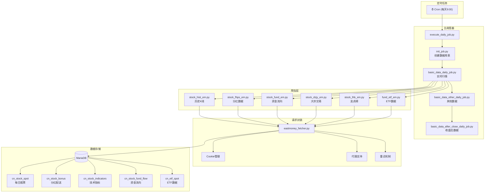
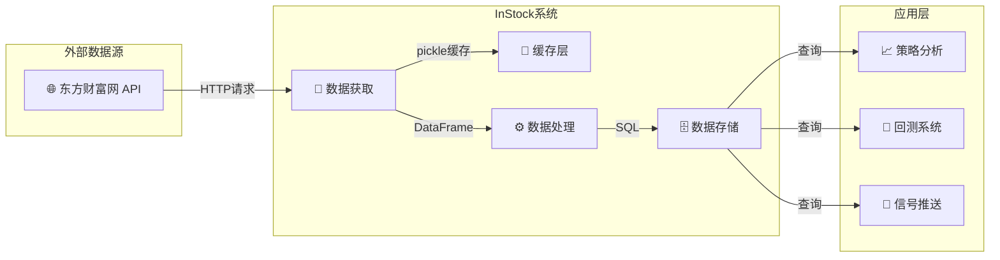
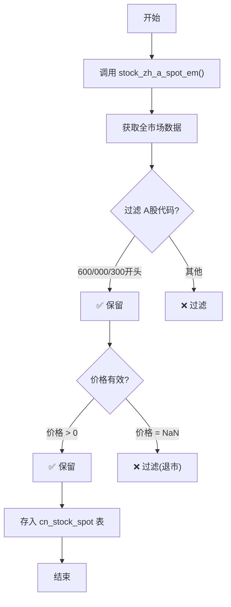
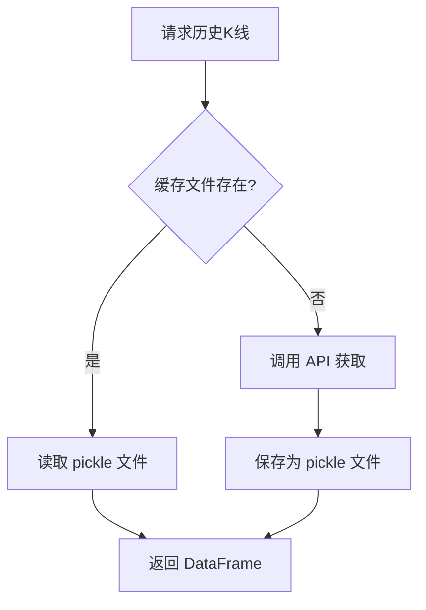
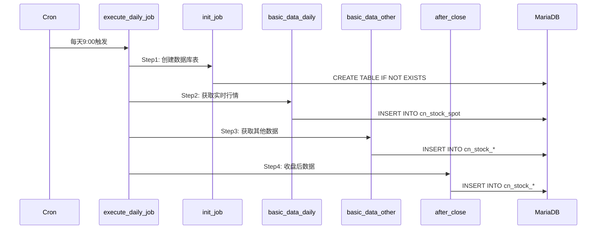
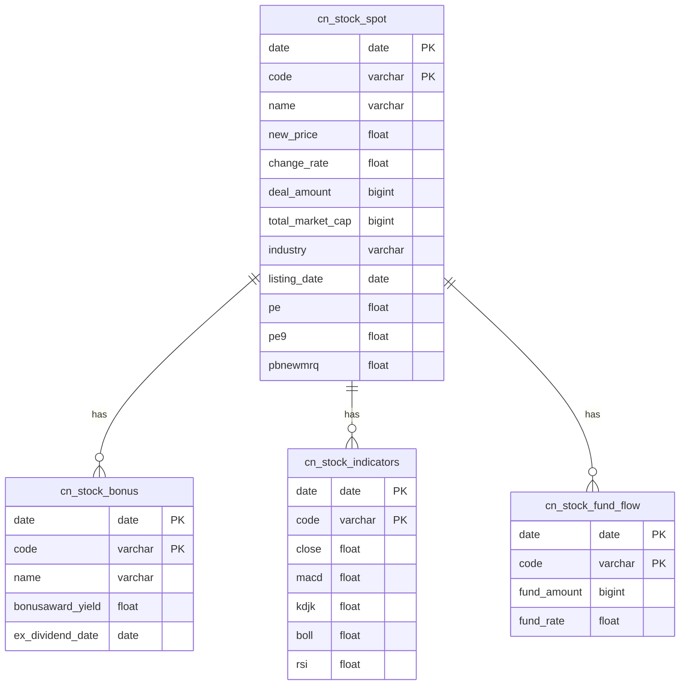
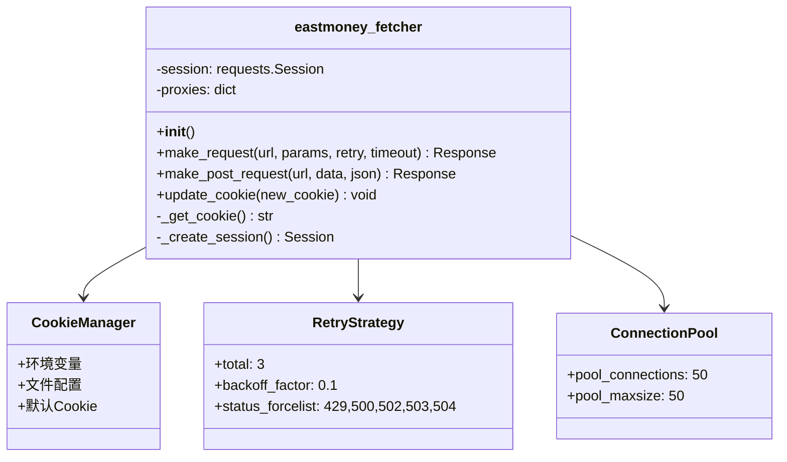
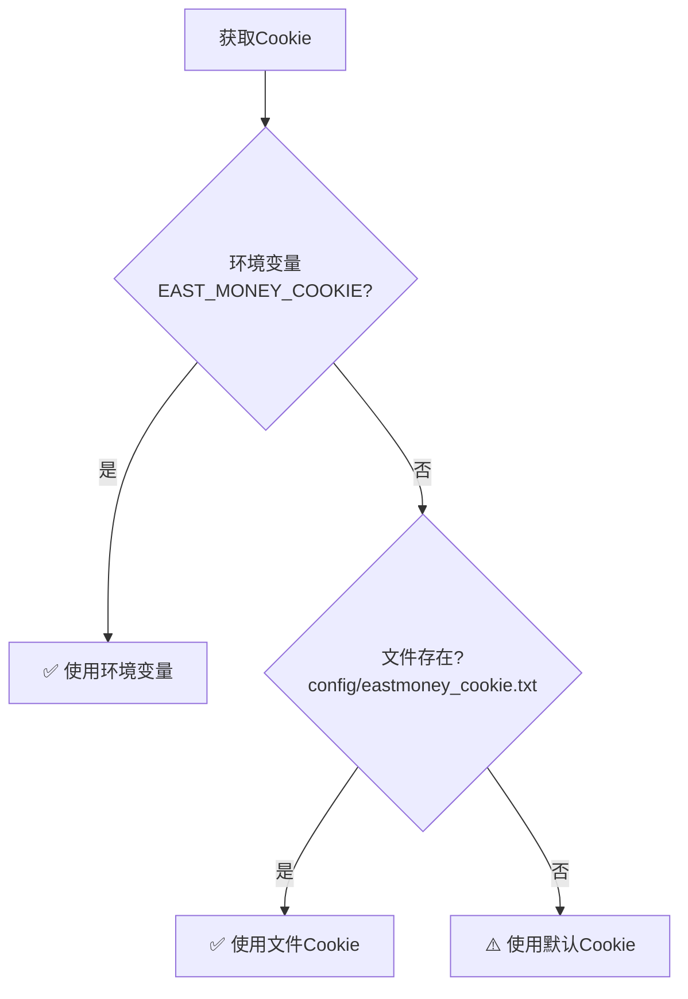

# InStock 股票数据获取流程详解

本文档详细说明 InStock 系统如何获取股票数据。

---

## 一、数据来源

**主要数据源：东方财富网**

| 数据类型 | API 地址 | 说明 |
|---------|---------|------|
| A股实时行情 | `http://82.push2.eastmoney.com/api/qt/clist/get` | 全市场股票实时数据 |
| 历史K线 | `http://push2his.eastmoney.com/api/qt/stock/kline/get` | 日/周/月K线数据 |
| 分红配送 | `https://datacenter-web.eastmoney.com/api/data/v1/get` | 分红送配数据 |
| 资金流向 | 东方财富资金数据接口 | 主力/大单/中单/小单 |
| ETF数据 | 东方财富ETF接口 | ETF实时行情 |

---

## 二、数据采集架构

### 整体流程图



### 数据流向图



---

## 三、核心采集脚本

### 1. 实时行情采集

**文件**: `instock/job/basic_data_daily_job.py`

```python
# 主要函数
save_nph_stock_spot_data(date)  # 股票实时行情
save_nph_etf_spot_data(date)    # ETF实时行情
```



### 2. 历史K线获取

**文件**: `instock/core/crawling/stock_hist_em.py`

```python
# 主要函数
stock_zh_a_hist(symbol, period, start_date, end_date, adjust)
```

| 参数 | 类型 | 说明 |
|------|------|------|
| `symbol` | str | 股票代码，如 "000001" |
| `period` | str | 周期：`daily`, `weekly`, `monthly` |
| `start_date` | str | 开始日期，如 "20240101" |
| `end_date` | str | 结束日期，如 "20250101" |
| `adjust` | str | 复权：`qfq`(前复权), `hfq`(后复权), `""`(不复权) |

**返回字段**：日期、开盘、收盘、最高、最低、成交量、成交额、振幅、涨跌幅、涨跌额、换手率

### 3. 分红数据获取

**文件**: `instock/core/crawling/stock_fhps_em.py`

```python
# 主要函数
stock_fhps_em(date="20231231")

# 报告期说明
"20231231"  # 年报
"20230930"  # 三季报
"20230630"  # 半年报
"20230331"  # 一季报
```

---

## 四、缓存机制

### 缓存结构

```
/data/InStock/instock/cache/hist/
├── 202401/
│   ├── 20240101/
│   │   ├── 000001qfq.gzip.pickle
│   │   ├── 000002qfq.gzip.pickle
│   │   └── ...
│   └── 20240102/
│       └── ...
└── 202402/
    └── ...
```

### 缓存读取流程



### 缓存优势

| 优势 | 说明 |
|------|------|
| ⚡ 速度 | 本地读取比API快10倍+ |
| 🔒 稳定 | 避免API限流 |
| 💰 成本 | 减少网络请求 |

---

## 五、定时任务配置

### 作业执行流程



### 运行命令

```bash
# 完整作业（当天数据）
docker exec InStock python3 /data/InStock/instock/job/execute_daily_job.py

# 批量补数据（日期范围）
docker exec InStock python3 /data/InStock/instock/job/execute_daily_job.py 2024-01-01 2024-12-31

# 补充特定日期
docker exec InStock python3 /data/InStock/instock/job/execute_daily_job.py 2026-03-01,2026-03-02,2026-03-03
```

### 作业脚本列表

| 脚本 | 说明 | 依赖 |
|------|------|------|
| `execute_daily_job.py` | 🎯 **主调度器** | 所有作业 |
| `init_job.py` | 创建数据库表 | 无 |
| `basic_data_daily_job.py` | 实时行情 | 网络 |
| `basic_data_other_daily_job.py` | 其他基础数据 | 网络 |
| `basic_data_after_close_daily_job.py` | 收盘后数据 | 网络 |
| `indicators_data_daily_job.py` | 技术指标 | 历史数据 |
| `strategy_data_daily_job.py` | 策略数据 | 技术指标 |
| `klinepattern_data_daily_job.py` | K线形态 | 历史数据 |
| `backtest_data_daily_job.py` | 回测数据 | 策略数据 |
| `selection_data_daily_job.py` | 综合选股 | 所有数据 |

---

## 六、数据库表结构

### ER 图



### 主要表字段说明

#### cn_stock_spot（每日股票数据）

| 字段 | 类型 | 说明 | 示例 |
|------|------|------|------|
| `date` | DATE | 日期 (PK) | 2024-01-15 |
| `code` | VARCHAR(6) | 股票代码 (PK) | 000001 |
| `name` | VARCHAR(20) | 股票名称 | 平安银行 |
| `new_price` | FLOAT | 最新价 | 12.50 |
| `change_rate` | FLOAT | 涨跌幅(%) | 2.35 |
| `deal_amount` | BIGINT | 成交额(元) | 1234567890 |
| `total_market_cap` | BIGINT | 总市值(元) | 250000000000 |
| `industry` | VARCHAR(20) | 所处行业 | 银行 |
| `listing_date` | DATE | 上市时间 | 1991-04-03 |
| `pe` | FLOAT | 市盈率(静) | 6.5 |
| `pe9` | FLOAT | 市盈率(TTM) | 6.2 |
| `pbnewmrq` | FLOAT | 市净率 | 0.65 |

---

## 七、请求封装

### eastmoney_fetcher 类结构



### Cookie 管理优先级



### 代理配置

```python
# 文件: instock/core/singleton_proxy.py
proxies = {
    'http': 'http://127.0.0.1:7890',
    'https': 'http://127.0.0.1:7890'
}
```

---

## 八、常见问题

### 问题诊断流程

```mermaid
flowchart TD
    A["数据采集失败"] --> B{"网络连接?"}
    B -->|"失败"| C["检查网络/代理"]
    B -->|"成功"| D{"API返回?"}
    D -->|"错误"| E["检查Cookie/限流"]
    D -->|"正常"| F{"数据解析?"}
    F -->|"失败"| G["检查API格式变化"]
    F ->|"成功"| H["✅ 完成"]
    C --> I["配置代理或换网络"]
    E --> J["更新Cookie"]
    G --> K["更新解析代码"]
    I & J & K --> A
```

### 问题1: 网络连接失败

```
错误: Connection aborted, RemoteDisconnected
```

**解决方案**:
```bash
# 1. 检查网络
ping baidu.com

# 2. 配置代理
# 编辑 instock/core/singleton_proxy.py
proxies = {
    'http': 'http://127.0.0.1:7890',
    'https': 'http://127.0.0.1:7890'
}

# 3. 检查DNS
cat /etc/resolv.conf
```

### 问题2: 数据缺失

```
数据库只有几天数据
```

**解决方案**:
```bash
# 补充历史数据
docker exec InStock python3 /data/InStock/instock/job/execute_daily_job.py 2024-01-01 2024-12-31
```

### 问题3: API限流

```
请求过于频繁被限制
```

**解决方案**:
- 系统已内置随机延迟（1-1.5秒）
- 使用缓存机制减少请求
- 更新Cookie

---

## 九、文件索引

### 目录结构

```
instock/
├── bin/
│   ├── run_cron.sh          # 🔧 Cron启动脚本
│   └── run_job.sh           # 🔧 作业运行脚本
│
├── job/                     # 📋 定时作业
│   ├── execute_daily_job.py # 🎯 主调度器
│   ├── init_job.py          # 数据库初始化
│   ├── basic_data_daily_job.py
│   ├── basic_data_other_daily_job.py
│   ├── indicators_data_daily_job.py
│   ├── strategy_data_daily_job.py
│   └── ...
│
├── core/
│   ├── crawling/            # 🕷️ 爬虫模块
│   │   ├── stock_hist_em.py   # K线数据
│   │   ├── stock_fhps_em.py   # 分红数据
│   │   ├── stock_fund_em.py   # 资金流向
│   │   ├── stock_dzjy_em.py   # 大宗交易
│   │   ├── stock_lhb_em.py    # 龙虎榜
│   │   ├── fund_etf_em.py     # ETF数据
│   │   └── trade_date_hist.py # 交易日历
│   │
│   ├── eastmoney_fetcher.py # 🌐 请求封装
│   ├── stockfetch.py        # 📊 数据获取
│   ├── singleton_stock.py   # 🔄 单例模式
│   └── tablestructure.py    # 📝 表结构定义
│
├── cache/
│   └── hist/                # 💾 历史数据缓存
│
└── config/
    └── eastmoney_cookie.txt # 🔑 Cookie配置
```

---

## 十、快速参考

### 常用命令速查

| 任务 | 命令 |
|------|------|
| 运行当天采集 | `docker exec InStock python3 /data/InStock/instock/job/execute_daily_job.py` |
| 补历史数据 | `docker exec InStock python3 .../execute_daily_job.py 2024-01-01 2024-12-31` |
| 查看数据库 | `docker exec InStockDbService mariadb -uroot -proot instockdb -e "SELECT * FROM cn_stock_spot LIMIT 5;"` |
| 查看日志 | `docker exec InStock cat /data/InStock/instock/log/stock_execute_job.log` |

### API 端点速查

| 数据 | 端点 |
|------|------|
| 实时行情 | `http://82.push2.eastmoney.com/api/qt/clist/get` |
| 历史K线 | `http://push2his.eastmoney.com/api/qt/stock/kline/get` |
| 分红数据 | `https://datacenter-web.eastmoney.com/api/data/v1/get` |

---

## 十一、参考资料

- [东方财富网数据接口](https://quote.eastmoney.com/)
- [InStock 原项目](https://github.com/myhhub/stock)
- [Mermaid 流程图语法](https://mermaid.js.org/)
